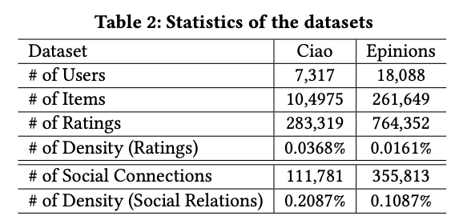
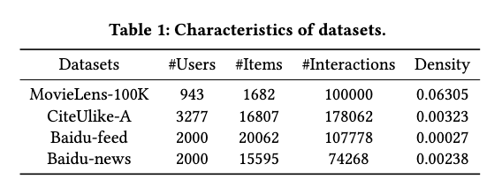
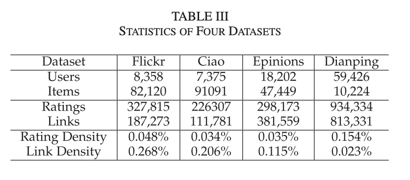
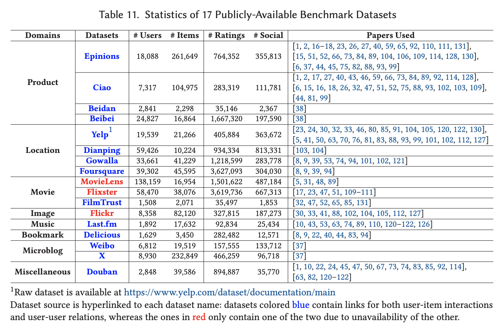
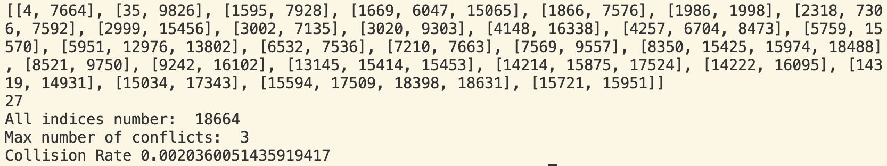
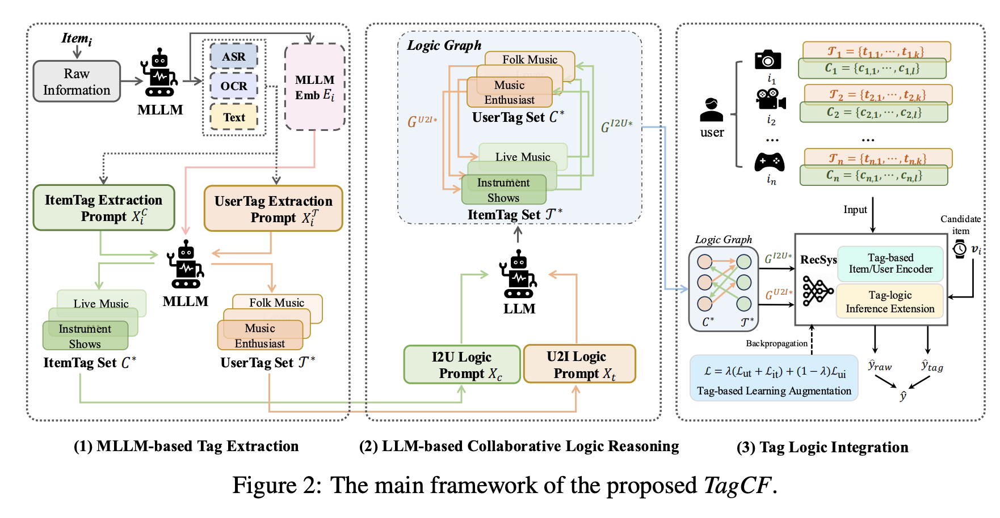
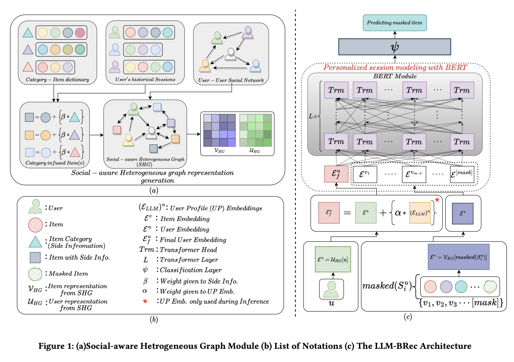

**Social Rec**

# 相关工作

## General Social Interactions
- Predicting positive and negative links in online social networks (2010 WWW)
- Type of social link can be predicted by user edges
- Who says what to whom on twitter (2011 WWW)
- Concentration of attention, homophily within categories of users

## Survey
- 早期
  - Social recommendation: a review (2013)
  - A survey of collaborative filtering based social recommender systems (2014)
- GNN方法
  - A survey of graph neural network based recommendation in social networks (2023, latest paper 2023)
  - Social recommender systems: Techniques, domains, metrics, datasets and future scope (2020)
  - A Survey of Graph Neural Networks for Social Recommender Systems (2024, latest paper 2022)

## Traditional Social Recommendation
- CF方法加social regularization，或者co-factorization: TrustMF, SoRec, SocialMF等
- **TrustMF** — A matrix factorization technique with trust propagation for recommendation in social networks (2010 Recsys)
- **SocialMF** — A matrix factorization technique with trust propagation for recommendation in social networks (2010 Recsys)
- **SoRec** — Sorec: social recommendation using probabilistic matrix factorization (2008 CIKM)
- **Social Regularization** — Recommender systems with social regularization (2011 WSDM)

## GNN-based
- GNN方法建模user-user edge：GraphRec, DiffNet, DiffNet++等，包括Hypergraph（一条边是多个点的set），最近也有用diffusion model的

### GraphRec
- Graph neural networks for social recommendation (2019 WWW)
- Dataset

### DiffNet
- A neural influence diffusion model for social recommendation (2019 SIGIR)
- Dataset
  - Rating >= 4, interaction >= 2, social link >= 2, random split 811
  - Yelp: https://www.yelp.com/dataset
  - Yelp 17237 38342; Flicker 8358 82120

### DiffNet++
- Diffnet++: A neural influence and interest diffusion network for social recommendation (2020 TKDE)
- Dataset
  - Rating >= 4, interaction >= 2, social link >= 2, random split 811
  - Yelp: https://www.yelp.com/dataset
  - Yelp 17237 38342; Flicker 8358 82120; Epinions 18202 47449; Dianping 59426 10224

### SocialLGN
- SocialLGN: Light graph convolution network for social recommendation (2022 Information Sciences)

### DHCF
- Dual Channel Hypergraph Collaborative Filtering (2020 KDD)
- Dataset

### MHCN
- Self-Supervised Multi-Channel Hypergraph Convolutional Network for Social Recommendation (2021 WWW)
- Dataset
  - Rating >= 4, 5 fold cross-validation
  - Yelp: https://github.com/Coder-Yu/QRec/tree/master/dataset/yelp2018
  - Yelp 19539 21266; Douban 2848 39586; LastFM 1892 17632

### HGSR
- Hyperbolic Graph Learning for Social Recommendation (2023 TKDE)
- Dataset
  - Rating >= 3 (写错了应该是4), random split 82

### GBSR
- Graph Bottlenecked Social Recommendation (2024 KDD)
- Dataset
  - Rating >= 4, random split 82
  - Yelp 19593 (写错了应该是19539) 21266; Douban-Book 13024 22347; Epinions 18202 47449

### HHGSA
- Heterogeneous Hypergraph Neural Network for Social Recommendation Using Attention Network （2025 TORS）

### SGSR
- Score-based generative diffusion models for social recommendations (2025 TKDE)
- Dataset
  - Rating >= 4, interaction >= 3, split 811 (donot know how to split)
  - Ciao & Epinions: https://www.cse.msu.edu/~tangjili/trust.html
  - Dianping: https://lihui.info/data/dianping/
  - Ciao 7317 104975; Epinions 18088 261649; Dianping 147918 11123

### ARD-SR
- Model-Agnostic Social Network Refinement with Diffusion Models for Robust Social Recommendation (2025 WWW)
- Dataset
  - Rating >= 4, interaction >= 3, chronologically split 811
  - Ciao & Epinions: https://www.cse.msu.edu/~tangjili/trust.html
  - Ciao 7291 17876; Epinions 22112 45464; Douban 2668 15940

## Cross-domain Recommendation
- **Embedding & Mapping paradigm**
  - CUT (SIGIR 24)
    - Aiming at the target: Filter collaborative information for cross-domain recommendation
    - User transformation under target domain similarity regularization
- **Unified Distribution paradigm**
  - social 关系与隐式反馈的区别是interaction从ui变为uu，而不存在其他数据分布的实体，所以可能更考虑这种范式
  - CDCDR (SIGIR 25)
    - CD-CDR: Conditional Diffusion-based Item Generation for Cross-Domain Recommendation
    - Domain-shared item representation by unified diffusion model
  - 还有很多和GNN结合的方法，与social rec中对GNN的利用较为相似

## Research Gap: Social × Semantic ID

- **调研**: Social Rec × Semantic ID 相关工作较少
  - SID 社区（TIGER, LC-Rec, LETTER, LLM-BS, SETRec, RPG等）22年开始，与 Social Rec 社区（GraphRec, DiffNet, GBSR）任务早期就有，GNN从19年开始
  - 4 篇 survey/handbook 均未提及另一方: GRID handbook (2025), VQ4Rec (2024), GNN Social Rec (2024), Gen. Rec. (2025)
  - 接近方向:
    - MMQ (WSDM 2026) 等方法多模态 SID (text+image)
    - ULMRec, UserLLM 等方法试图建模User Profile到SID
- SID 中已有 user encoding 方法（user prompt, user token 对齐），但关注 per-user 个性化，不涉及 user 间结构化关系
- 多模态 SID (text+image→codebook) 已有成熟方案（MMQ, MQL），但无工作将 social 作为"模态"

---

# 数据集：Rating matrix + user edges

- **Douban** — https://github.com/Coder-Yu/QRec/tree/master?tab=readme-ov-file#related-datasets
- **DoubanBook** — https://github.com/librahu/HIN-Datasets-for-Recommendation-and-Network-Embedding/tree/master/Douban%20Book
- **Yelp** — https://github.com/Coder-Yu/QRec/tree/master/dataset/yelp2018
  - https://github.com/Coder-Yu/QRec/tree/master?tab=readme-ov-file#related-datasets
- **Epinions** — https://www.cse.msu.edu/~tangjili/trust.html
  - https://github.com/Coder-Yu/QRec/tree/master?tab=readme-ov-file#related-datasets
- **Ciao** — https://www.cse.msu.edu/~tangjili/trust.html
  - https://github.com/Coder-Yu/QRec/tree/master?tab=readme-ov-file#related-datasets

**Rating >= 4, interaction >= 3, chronologically leave-one-out**

|  | User | Item | Inters | Trusts |
| --- | --- | --- | --- | --- |
| Douban | 2664 | 15938 | 535198 | 32705 |
| DoubanBook | 11383 | 21731 | 595393 | 792062 |
| Yelp | 19535 | 15045 | 440526 | 143765 |
| Ciao | 7634 | 18663 | 145207 | 57144 |
| Epinions | 42326 | 53552 | 576286 | 355813 |

---

# 初步实验

|  | **BPR** |  | **SASRec** |  | **LC-Rec** |  | **TIGER** |  |
| --- | --- | --- | --- | --- | --- | --- | --- | --- |
|  | Hit@10 | NDCG@10 | Hit@10 | NDCG@10 | Hit@10 | NDCG@10 | Hit@10 | NDCG@10 |
| Douban | 0.0068 | 0.0042 | 0.1592 | 0.0986 |  |  |  |  |
| DoubanBook | 0.0922 | 0.0534 | 0.0521 | 0.0273 |  |  |  |  |
| **Yelp** | 0.0365 | 0.0176 | 0.0554 | 0.0301 |  |  |  |  |
| **Ciao** | 0.0283 | 0.0147 | 0.0333 | 0.0175 | 0.0251 | 0.0136 | 0.0199 | 0.0107 |
| **Epinions** | 0.0420 | 0.0228 | 0.0441 | 0.0248 |  |  |  |  |

TIGER (Ciao) 使用和LC-Rec相同的语义ID，（均基于SASRec embedding）

目前的观察，**Yelp，Ciao，Epinion**这几个数据集序列性会强一些，另外的两个数据集DoubanBook里CF模型表现较好，Douban的效果有些问题

---

# Backbone实现

在Yelp，Ciao，Epinion上跑LC-Rec的结果：
因Ciao的数据集没有文本信息，目前看到有两篇文章用SASRec的embedding初始化RQVAE做tokenization （LLaDA-Rec，ETEGRec）在amazon几个数据集的表现都是不输于文本初始化的RQVAE，我们可以也这么做，然后Epinion&Yelp正常用文本初始化

**RQVAE tokenizer训练**
- Yelp: SASRec_best_20260113_061228.pth
- Ciao: SASRec_best_20260109_010834.pth
- Epinions: SASRec_best_20260116_181427.pth

|  | SASRecCollision_rate | title&rating embCollision_rate |
| --- | --- | --- |
| **Yelp** | 0.0024 | N/A |
| **Ciao** | 0.0498 | N/A |
| **Epinions** | 0.1302 |  |

Ciao的index/generate_indices.py最后一轮迭代：

这是用了Sinkhorn算法降低collision了，这个rate等于38/18664

LC-Rec尝试了初步调参，在Ciao上表现目前不够好（目前表现类似BPR比不过SASRec），可能因为他的6个任务不能全部跑，因为没有user文本信息不能跑其中2个。

---

# 初步思路

## LLM 结合方向

- **Social信息融入prompt中**（类似user profile加feature）
  - Who You Are Matters: Bridging Topics and Social Roles via LLM-Enhanced Logical Recommendation (Kuaishou, NeurIPS 2025)

  

- **和GNN-based social信息融合**，GNN处理关系，LLM处理user/item文本（比较解耦）
  - LLM-BRec: Personalizing Session-based Social Recommendation with LLM-BERT Fusion Framework (Sony Research, Gen-IR@SIGIR2024)

  

- **用户作为agent**
- 目前还没有**结合语义ID**的工作
- 最简单的可以借鉴多模态的工作将社交信息视为一个模态，和内容信息并列做编码
- 也可以设计一些辅助任务，例如Predicting positive and negative links这篇，引入社交领域的监督

## Insight: Social 的独特性 — 推理逻辑

- **核心问题**: Social 和其他 user feature 有什么本质不同？
- **Step 1**: Social 是 user-level feature，不是 item-level feature
  - Social 信息不能编入 history item 交互序列的 tokens（它是 user-user 关系）
  - SID 已有很多 user encoding 方法，social 理论上也可以用
- **Step 2**: Social signal 不是属于单个 user 的 feature
  - 普通 user feature（年龄、性别）独立于其他 users
  - Social 是一个**图结构**，编码 users 之间的**相互依赖关系**
- **Step 3**: Social signal 属于协同信号
  - Social 本身是协同信号（user-user interaction），和 CF 类似，可被预测作为辅助任务

> **定位**: 以 framework/plugin 形式为 SID 增加 social module —— 但不能简单套用多模态 SID（social 不是 per-item 的）以及user-centric SID（social 不是每个user独立的）

## 3 个 Candidate 方向

- **#1: Social as Structured Collaborative Prior** （比较可操作）
  - Social graph 提供协同信号，编码 cluster/edge
  - 本质区别: 多模态 SID 各模态是 per-item 的，social 是 per-graph-structure 的
  - **Plugin 兼容性好**: 只需在 user encoder 侧加入 social 模块，配合social信号监督的辅助任务，不改变 tokenization 或 generation，可接入任何 SID backbone
- **#2: Zero-shot Generation via Social** （好讲故事）
  - Social connections 让 SID 模型获得冷启动能力 — 新 user 有 social link → neighbor 行为作 behavioral anchor → 跳过behavior sequence直接生成 token
  - 解决 user-side 冷启动 — text/image 解决 item-side，social 解决 user-side，也可以引入userrelated item信息
  - 可能更多在推理时引入
- **#3: Inter-user Generation Dependency** （难度较高）
  - 去掉"每个 user 独立生成"的基本假设 — 现有 SID 中从未考虑
  - Socially connected users 的生成过程应有联合分布
  - 实现难度高，需修改生成过程本身

---

# Method Candidates

- **目标**: 设计 framework/plugin，为现有 SID 模型增加 social module
- **对比表格**:

  | Approach | Core Idea | Insight |
  |----------|-----------|---------|
  | Social Auxiliary Task | SID 训练 + link prediction 辅助任务 | #1 |
  | Social Codebook | 经典方法的 embedding 引入 codebook | #1, #3 |
  | Beam Search | 在infer/beamsearch阶段 引入 social prior | #2 |

### Social Codebook（编码社交信息至codebook）
- DiffNet/GraphRec 预训练 social embedding → 引入 user-centric 的 codebook 初始化/学习的过程

### Social Auxiliary Task（训练时引入社交监督信号的辅助任务）
- 在 SID 训练中加入 social supervision (link prediction)
- 之前已有经典文献formulate task/setting:
  - 2010 WWW + 2011 WSDM social regularization, 让 user encoder 隐式学到 social-aware 表示

### Beam Search
- 引入策略不能太简单（social neighbor 偏好 ≠ target user 偏好）

# 对公司方法的增强

我们增强codebook和用辅助任务训user-centric social-aware codebook之后，公司里可以用codebook里增强的embedding
